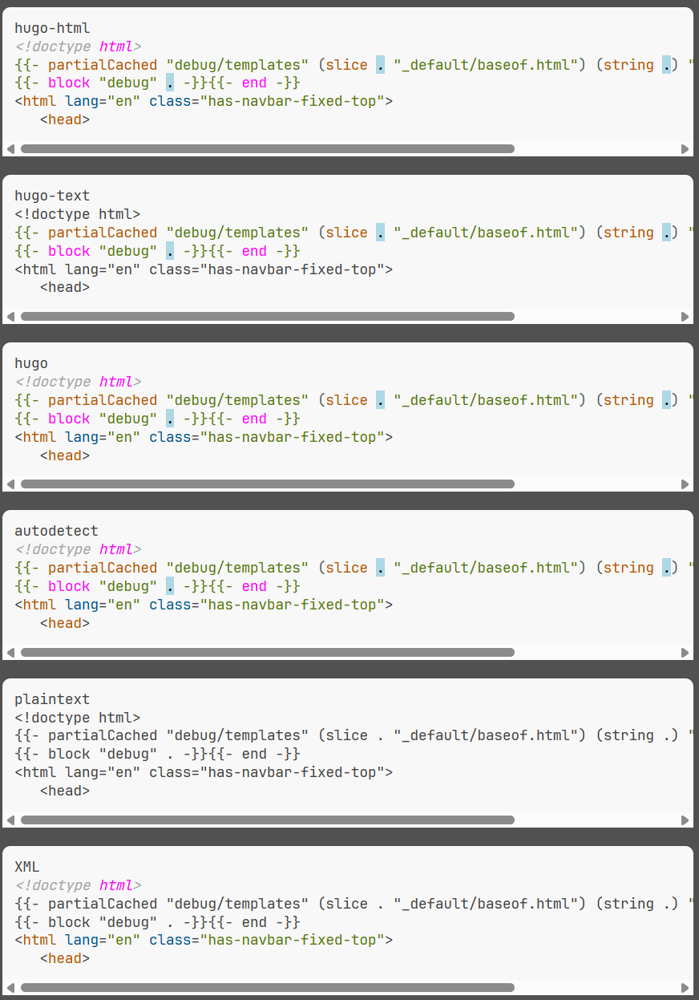

# Highlight.js 4 Hugo - Syntax highlighting for Hugo-Text templates

This is the README for the Hugo-Text variant of the suite.



[](LICENSE)

A language grammar to highlight [Hugo][]'s templating language with [Highlight.js][].

- [CSS class reference](css-class-reference.md)

## Requirements

The module has been implemented using [Highlight.js][] version 11.11.1.

It will most likely not work with an older version.

## Usage

Include the `highlight.js` library in your webpage or Node app, then load this module.

### Static website or simple usage

Load the module after loading `highlight.js`. Take the minified version from `dist` directory.

```html
<!-- example using cloudflare CDN. check the original docs for other options -->
<script type="text/javascript" src="/path/to/highlight.min.js"></script>
<!->
<script type="text/javascript" src="/path/to/hugo-text.min.js"></script>
<script type="text/javascript">
  hljs.highlightAll();
</script>
```

### Using a CDN

The module has not been published to any CDN right now. just download it from the dist folder

<!-- TODO: publish to a CDN later

### Using directly from the UNPKG CDN

```html
<script
   type="text/javascript"
   src="https://unpkg.com/highlightjs-hugo-text@0.1.0/dist/hugo-text.min.js"
></script>
```

-  More info: <https://unpkg.com>
-->

### With Node or another build system

If you're using Node / Webpack / Rollup / Browserify, etc, simply require the language module, then register it with
`highlight.js`.

```javascript
var hljs = require("highlight.js");
var hljsHugo = require("hugo-text");
hljs.registerLanguage("hugo-text", hljsHugo-Text);
hljs.highlightAll();
```

## A word on auto detection

_Handlebars_ and _Go templates_ (used by [Hugo][]) have similar template tags. Without additional relevance settings the
Hugo modules will loose most of the time. To beat Handlebars auto-detection for _Hugo_ templates we add relevance
settings. Doing our best to make it possible to have both modules loaded at the same time. Importing `hugo-text` and
`hugo-html` plugins may result in undetermined auto selection.
To be on the safe side specify the language you want for every code block.

- for Go template comments we use relevance = 10.

  comments start with `{{/*` or `{{- /*` and end with `*/}}` or `*/ -}}`

- functions in the _hugo_ namespace use relevance = 10 (e.g. hugo.IsDevelopment)

- We mark the following _Handlebars_ opening template tags as invalid for us: `{{#`, `{{>`, `{{!--`, `{{!`

  `IgnoreIllegals` default value is `false` since version 11. So this stops highlighting with the hugo module


## License

This package is released under the MIT License. See [LICENSE](LICENSE) file for details.

### Author & Maintainer

- Irkode <irkode@rikode.de>

## Links

Module Repository: [https://github.com/irkode/highlightjs-hugo-text]()

### Other references

- [Highlight.js][]
- [Hugo][]
- [Go HTML template](https://pkg.go.dev/html/template)
- [Go TEXT template](https://pkg.go.dev/text/template)

[Highlight.js]: https://highlightjs.org/
[Hugo]: https://gohugo.io/
